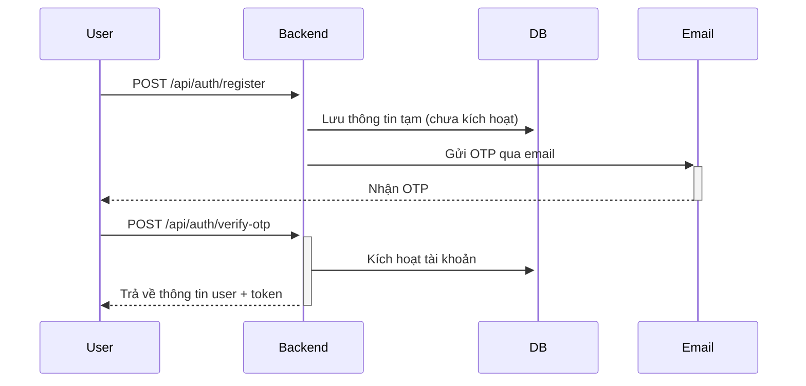
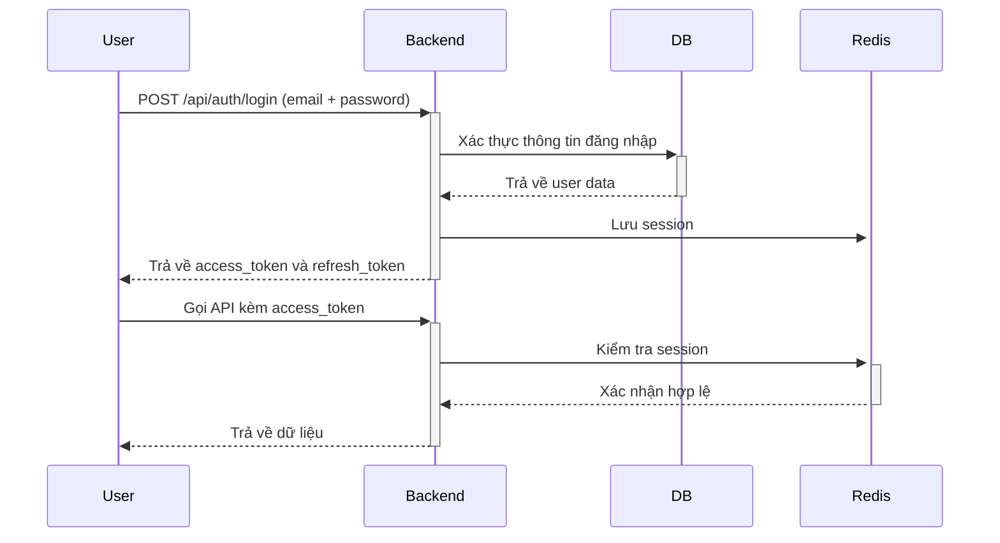

# DoraeChat Backend API

[](https://nodejs.org/)
[](https://www.mongodb.com/)
[](https://redis.io/)

Backend API cho ứng dụng nhắn tin DoraeChat với các tính năng hiện đại như chat 1-1, nhóm, gọi điện, gửi file và tích hợp đăng nhập bằng QR code.

## 📌 Tính năng chính

- **Xác thực người dùng**: Đăng ký, đăng nhập, OTP qua email, refresh token
- **Quản lý người dùng**: CRUD user, cập nhật profile, avatar
- **Trò chuyện**: Tin nhắn 1-1, nhóm, kênh (channel)
- **Đa phương tiện**: Hỗ trợ gửi hình ảnh, video, file
- **Quản lý nhóm**: Thêm/xóa thành viên, phân quyền, yêu cầu tham gia
- **Tin nhắn ghim**: Ghim tin nhắn quan trọng trong hội thoại
- **Bình chọn**: Tạo và quản lý bình chọn trong nhóm
- **Kết bạn**: Gửi/lời mời kết bạn, gợi ý bạn bè
- **Đăng nhập QR**: Quét QR code để đăng nhập
- **Phân loại**: Nhóm hội thoại theo danh mục tùy chỉnh
- **Lưu trữ đám mây**: Upload file lên Cloudinary

## 🛠 Công nghệ sử dụng

- **Backend**: Node.js, Express.js
- **Database**: MongoDB
- **Cache**: Redis
- **Realtime**: Socket.IO
- **Lưu trữ file**: Cloudinary
- **Xác thực**: JWT, OTP
- **Email**: Nodemailer

## 🔧 Cài đặt

1. Clone repository:
```bash
git clone https://github.com/minhducn14/DoraeChat_BE
```
2. Cài đặt dependencies:
```bash
npm install
```
3. Tạo file .env dựa trên .env.example và điền các biến môi trường cần thiết
4. Chạy server:
```bash
npm run start
```
🔒 Quy trình xác thực
1. Đăng ký

2. Đăng nhập

3. Refresh token
```mermaid
sequenceDiagram
    participant Client as Ứng dụng Client
    participant Backend as Backend Server
    participant Redis as Redis Cache
    participant DB as Database

    Client->>Backend: POST /api/auth/refresh-token
    Note right of Client: Gửi kèm refresh_token trong header
    
    Backend->>Backend: Giải mã refresh_token
    alt Token hợp lệ
        Backend->>Redis: Kiểm tra token trong denylist
        Redis-->>Backend: Token không trong denylist
        Backend->>DB: Truy vấn user từ token payload
        DB-->>Backend: Thông tin user
        
        Backend->>Backend: Tạo access_token mới (30 phút)
        Backend->>Backend: Tạo refresh_token mới (7 ngày)
        
        Backend->>Redis: Lưu refresh_token cũ vào denylist
        Backend->>Redis: Lưu session mới
        
        Backend-->>Client: HTTP 200 + {access_token, refresh_token}
        Note left of Backend: Token mới có thời hạn ngắn hơn
        
    else Token không hợp lệ/hết hạn
        Backend-->>Client: HTTP 401 Unauthorized
        Note left of Backend: {"error": "Invalid/expired refresh token"}
        
    else Token trong denylist
        Backend->>Redis: Kiểm tra denylist
        Redis-->>Backend: Token bị thu hồi
        Backend-->>Client: HTTP 403 Forbidden
        Note left of Backend: {"error": "Token was revoked"}
    end
   ```

⚠️ Xử lý lỗi
Hệ thống sử dụng HTTP status codes chuẩn:

- 200 OK: Thành công

- 201 Created: Tạo mới thành công

- 400 Bad Request: Dữ liệu không hợp lệ

- 401 Unauthorized: Chưa xác thực

- 403 Forbidden: Không có quyền truy cập

- 404 Not Found: Tài nguyên không tồn tại

- 500 Internal Server Error: Lỗi server 
